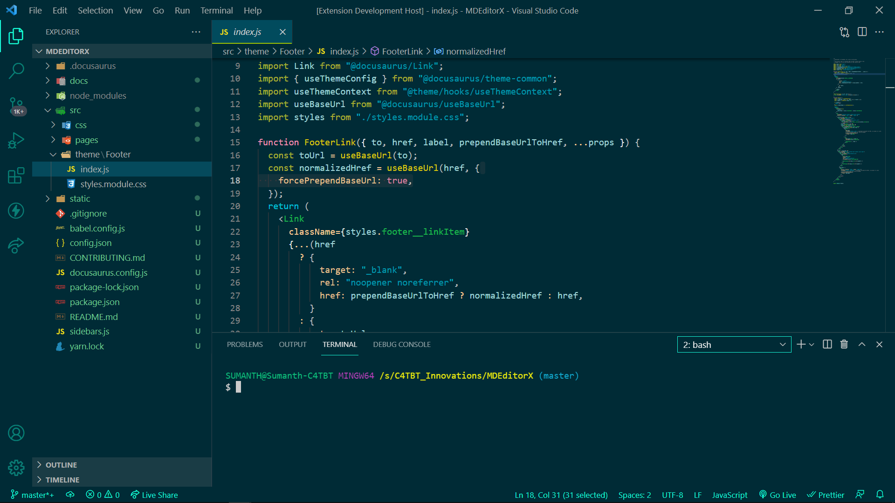

# CodeHouse.C4TBT Theme for VS Code

[]

## Installation 🛠

1. Open the extensions sidebar on Visual Studio Code
1. Search for `CodeHouse Theme`
1. Click Install
1. Click Reload to reload your editor
1. Select the Manage Cog (bottom left) > Color Theme ＞ `CodeHouse Theme`
1. 🌟🌟🌟🌟🌟 Rate five-stars 😃

## Issues & Suggestions

For any issues or suggestions, please use [GitHub issues](https://github.com/c4tbrilliantthoughts/c4tbt-vscode-theme/issues).

## Made with 💛 open source

Created by: [Sumanth Sanathi](https://c4tbt.hashnode.dev)
